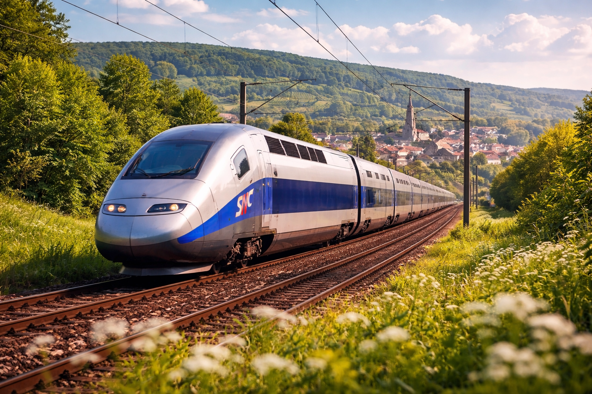
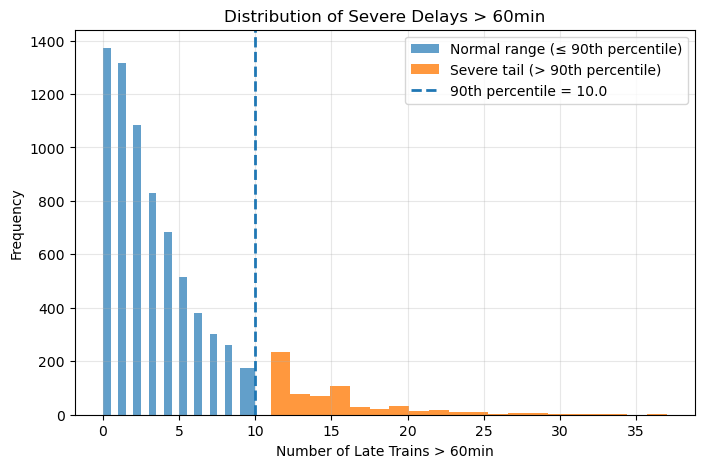
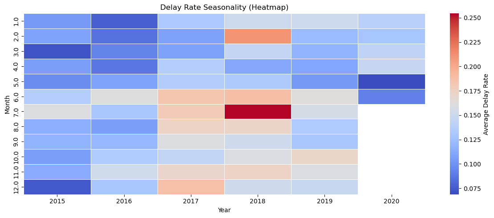
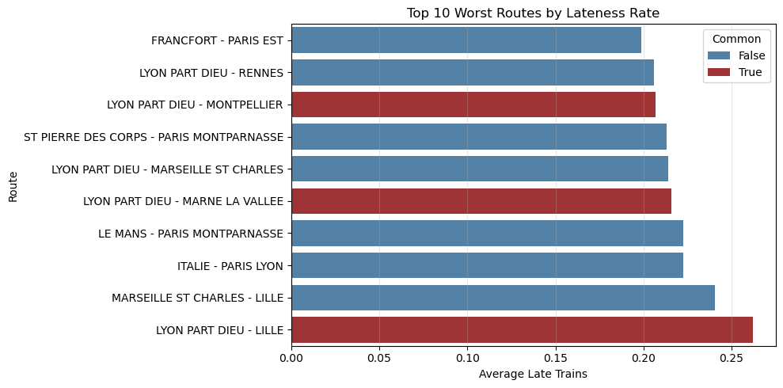
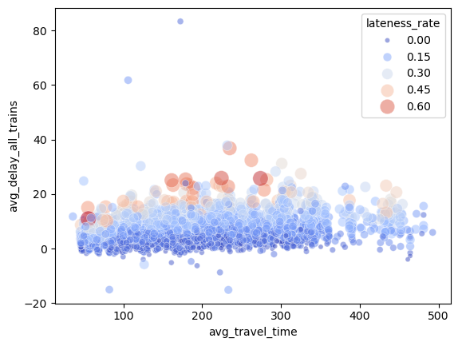
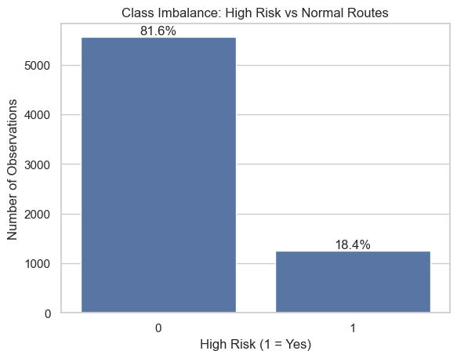
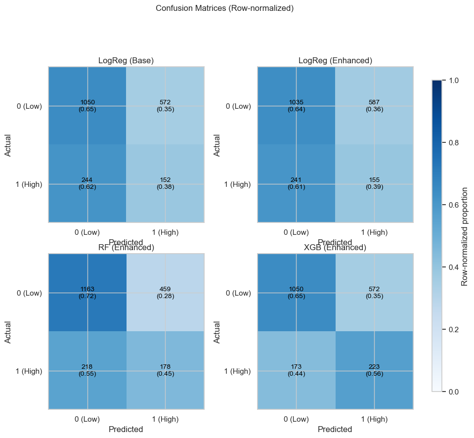
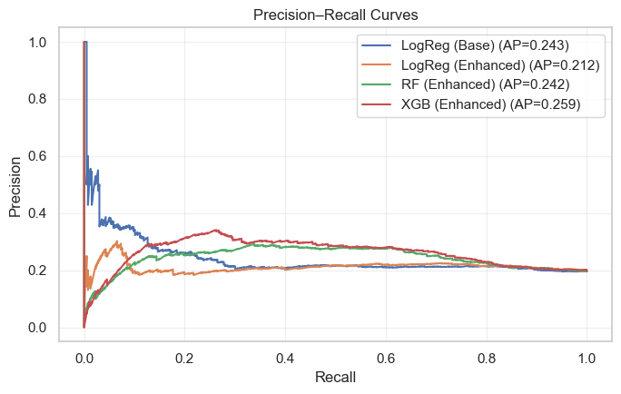
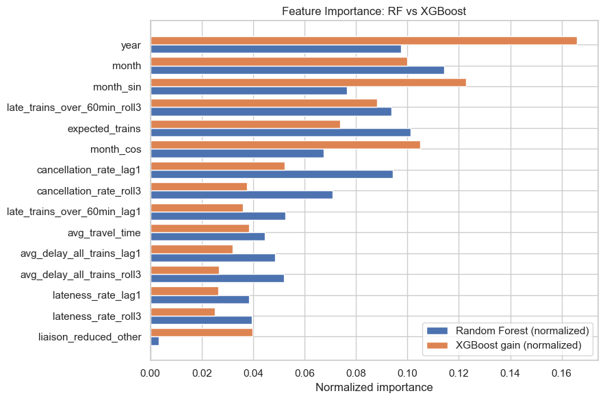

# Railway Reliability Prediction 

  

*Link to GitHub Repo:*
*https://github.com/fangwan90/HaaS_Git/blob/main/Capstone/Capstone.ipynb*

---

### A. Problem Statement

How can a railway operator improve the reliability of its railway system? 

This project uses France high-speed rail (TGV) punctuality and disruption data to perform exploratory analysis to identify **what/where/when/why** delays occur, and builds **simple, interpretable predictive models** to forecast near-term reliability risk by route.

The analysis will help to reveal a **list of prioritised routes / liaisons** for the railway operator to focus on for preventive maintenance in the coming month, based on past data. 

### B. Data Source

*Data Source: https://www.kaggle.com/datasets/gatandubuc/public-transport-traffic-data-in-france?select=Regularities_by_liaisons_Trains_France.csv*

The dataset contains all the point-to-point delay / on-time data for the TGV, accompanied by the percentage contribution by various causes of delays. The challenge is in obtaining useful insights from this set of processed data, to be able to advise a prioritisation framework for fault prevention. 

### C. Project Objectives

1. **Descriptive analysis** to understand:
   - **What** types of delays dominate,
   - **Where** the worst-performing routes are,
   - **When** reliability degrades (seasonality and trends),
   - **Why** disruptions occur (operational drivers).

2. **Predictive modelling** to forecast **high-risk routes** in the next time period using leakage-safe features.

3. **Actionable recommendations** for operations and maintenance planning.

---

### D. Feature Engineering 

The modelling dataset is constructed at the **route–month** level and includes the following features:

- **Time/Seasonality:** `year`, `month`, `month_sin`, `month_cos`  
- **Exposure:** `expected_trains`, `avg_travel_time`  
- **Outcomes:** delay and cancellation metrics  
- **Route identity:** one-hot encoded liaisons (`liaison_reduced_*`) 
- **Past Trends(leakage-safe):** e.g., `lateness_rate_lag1`, `lateness_rate_roll3`

### E. Target Variable: High-Risk Route
A route–month is labeled **high risk** if it exhibits severe operational disruption (e.g., high cancellations, extreme lateness, chronic long delays).  
For forecasting validity, features in the past month and beyond, are used to predict **high risk in the following month**.

---

### F. Modelling Approach

Multiple models were trained and compared using **time-aware splits**:

- Logistic Regression (baseline and enhanced)
- Random Forest (enhanced)
- XGBoost (enhanced)

### G. Class Imbalance
Rather than generating synthetic samples, models use:
- **`class_weight="balanced"`** where applicable

### H. Evaluation Metrics (Priority Order)
Given the rarity and operational cost of high-risk events (<20% of all month-routes>):
- **Recall (primary):** minimize missed high-risk routes  
- **F1-score (secondary):** balance recall and false alarms  
- **PR-AUC:** ranking quality under strong class imbalance  

---

### I. Key Visualizations

*Descriptive Analysis*

- **Delay distributions and tail-risk**: The distribution of trains delayed by more than 60 minutes exhibits a pronounced right-tail. While most route-months experience fewer than 10 such delays, a small subset shows extreme counts, with some exceeding 30 events. This heavy-tailed behavior indicates that system risk is dominated by rare but severe disruption regimes. Consequently, our modelling focuses on identifying and forecasting these tail events rather than optimizing average performance.

  

- **Seasonality effects**: Delay rates exhibit clear seasonality, with consistently higher values during mid-year months and lower levels toward year-end. Additionally, 2017–2018 show elevated delays across multiple consecutive months, indicating periods of systemic stress rather than isolated disruptions. This temporal structure supports the use of lagged features and seasonal encodings in our predictive models and suggests that targeted, season-specific interventions could materially improve network reliability. 

  

- **Worst routes by cancellations and lateness**: Routes starting from a few stations seem to dominate as worst performers on various metrics. 

  

- **Travel time vs delay with lateness intensity**: Average travel time is not a strong predictor of unreliability. Instead, high delays and high lateness rates are concentrated in specific routes across all distance ranges. We will later see that departure station alone is also not a strong predictor, suggesting that other factors (e.g. expected number of trains for that route) is actually more predictive - not its length, not its location. 

  

*Predictive Analysis and Model Comparison* 

- **Class imbalance**: There is strong class imbalance, as we are looking at tail risk. Our aim is to perform better than random guessing, which would get us correct about 20% of the time. 

  

- **Confusion matrices (row-normalized) across models**: Confusion matrix comparisons show that our best performing model, XGBoost correctly flags approximately 56% of high risk routes - almost triple the performance of random guessing, and signfiicantly improving the risk identification capability compared to simple base models such as logistic regression, while balancing for operational constraints through reduction of false positives. This also suggests non-linear relationships for such analysis. 

  

- **Precision–Recall curves**: Precision–Recall analysis shows that the enhanced XGBoost model provides the best ranking of high-risk months, achieving the highest average precision (0.259). It outperforms other models across the full recall range, making it the most balanced and suitable model. 

  

- **Feature importance comparisons (RF vs. XGB)**: Feature importance analysis shows that high risk events are primarily driven by temporal structure and recent performance momentum - aligned with our earlier descriptive analysis. Lagged trend features dominate, indicating possibility of catching such issues early before major breakdowns if the operator adopts simple trending analysis over time even at key indicators level (i.e. processed data).  

  

---

### J. Conclusion 

This study show that railway reliability is not primarily driven by route length or departure station alone, but by route-specific operational patterns and historical performance dynamics. Trending of such indicators over time is therefore already a powerful first step that Operators can take to pre-empt high risk failures. 

*Key Insights* 
- **High-risk events are rare but predictable**: Severe delays and cancellations tend to follow recent deterioration in performance rather than occurring randomly.
- **History matters more than structure**: Lagged lateness and cancellation rates are stronger predictors of future risk than static characteristics such as route length or departure station.
- **Tail risk dominates passenger experience**: Extreme delays, though infrequent, disproportionately shape perceptions of system reliability—justifying a recall-first modelling strategy.
- **Interpretable models are sufficient**: Logistic regression, Random Forest, and XGBoost capture key patterns effectively while remaining explainable for operational use.

*Recommended Next Steps* 
- **Key performance trending**: (e.g. cancellation rate, lateness rate) over the last few months is already a powerful first step to pre-empt high risk failures 
- **Seasonal playbooks**: Implement month-specific readiness measures during historically high-risk periods. Given that summer months seem to always rank high on service disruptions 

*Modeling Improvements* 
- **Trending of past delay causes**: could shed further light on impact e.g. of infra vs ext factors, to advise targeted preventive maintenance regimes or prioritisation 
- **Cost-weighted decisioning**: Combine predicted risk with train volume or passenger exposure to prioritize interventions by impact to the commuters
- **Continuous monitoring**: Deploy model in a rolling forecast framework, retraining periodically and tracking intervention outcomes.

