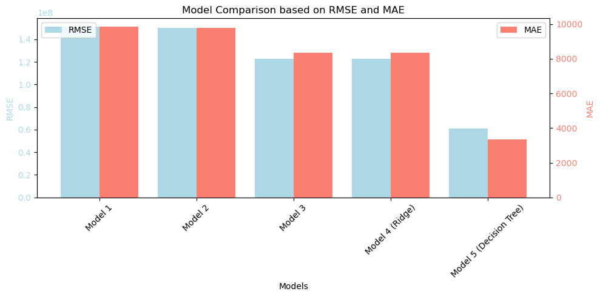

## Resale Car Value Prediction 

**Link to GitHub Repo:**
https://github.com/fangwan90/HaaS_Git/tree/4369ef6b0d6507a6e930cba67c47f6c8f9f5a22d/PA2

### A. Problem Statement

**Background***: In the resale car industry, the client (a used car dealership) wants to know how it can finetune its inventory to maximise its value and sale-ability. A dataset containing information of 3 million used cars is used to conduct this analysis. 

**Problem Statement**: Create a machine learning model to predict car prices, and advise a used car dealership on inventory management based on what consumers value in a used car.

**Tasks**:

a. **Data understanding**: Understand the key attributes and its relationship to price.  
b. **Data Preparation**: Clean, transform, and select key features to retain for modelling.  
c. **Model Building**: Create machine learning models to predict car prices.  
d. **Model Evaluation**: Compare against other possible models to recommend the best one.

### B. Results 

A few models were created to try and predict car prices, to help the client estimate if a car was of value to retain / incorporate into its inventory. 

a. Model 1: Simple Linear Regression with numerical features (year, odometer range)
b. Model 2: Simple Linear Regression with more numerical features (year, odometer, condition of car)
c. Model 3: Simple Linear Regression with numerical and categorical features 
d. Model 4: Ridge Regression with numerical and categorical features 
e. Model 5: Decision Tree Model with numerical and categorical features

Based on the outcome as shown below when comparing RMSE and MAE values, Model 5 was most desirable. This is possibly because many of the determining factors for car price were categorical in nature and not a continuous numerical feature. 

### C. Conclusion 

This project analysed the various features that could affect car pricing, aiming to predict a car price and to advise the client on how best to manage its inventory. Some of the key insights: 

a. The 'year' of a car does not have strong correlation to its price but was listed in both ridge and decision tree models as an important feature. At its extremes (e.g. when it is an antique car), the price can be significantly higher. The client should consider the value of high value antiques if it considers itself an antique resaler. 

b. The 'odometer' mileage should be as low as possible, or very high (when it is an antique). 

c. The 'model' to consider that either generate high sale price, or high sale volume (resulting in generally high sale value) are mercedes-benz, chevrolet, volvo, ford and toyota. Brands such as jeep and nissan are also relatively popular.

d. The 'fuel', 'transmission', 'title_status' preferred are 'gas', 'automatic', and 'clean'. Do not consider other types. 

e. The 'color' does not really matter. 

f. The 'state' that tends to have higher sales prices are West Virginia, Montana, and Alaska. Client can consider setting up franchises there. 

The decision tree model was best fit for analysing this dataset since many of the determining features were categorical in nature, especially in terms of car model based on its weightage given in the eventual modelling. 
