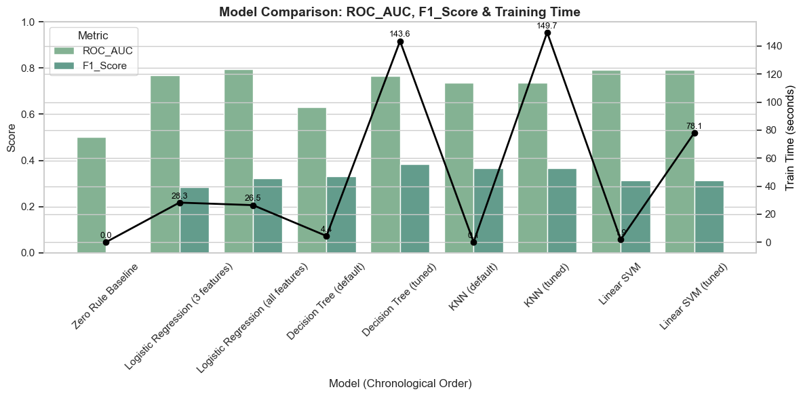
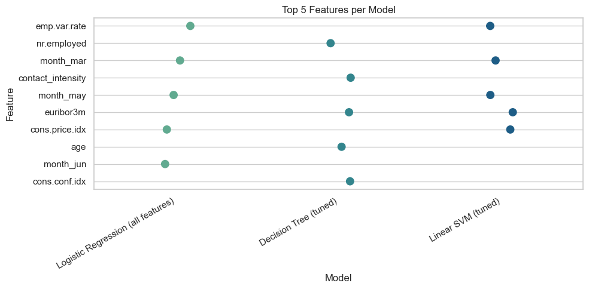

## UCI Banking Campaign Success Prediction 

**Link to GitHub Repo:**
https://github.com/fangwan90/HaaS_Git/tree/ecada722b209f97f450b866bdca7f1e1553c90ee/PA3 

### A. Problem Statement

**Background***: A Portuguese bank wants to know the key success factors for its marketing campaign i.e. what makes customers subscribe to their long-term deposit. A dataset collected from 17 campaigns, with 41K rows of data, is used for this analysis.  

**Problem Statement**: Create a machine learning model to predict whether an outbound call will result in a subscription (y: 1/0,), so that the bank can prioritise high-propensity customers to improve agency productivity, and reduce annoyance for those who low propensity. 

**Tasks**:

a. **Data understanding**: Understand the key attributes and their relation to chance of subscription. 
b. **Data Preparation**: Clean, transform, and select key features to retain for modelling.  
c. **Model Building**: Create machine learning models to predict likelihood of subscription (y). 
d. **Model Evaluation**: Compare against other possible models to recommend the best one.

### B. Results 

A few models were created (and tuned) to try and predict high propensity customers: 

a. Zero Rule Model 
b. Logistic Regression + GridSearchCV on Logistic Regression 
c. Decision Tree + GridSearchCV on Decision Tree 
d. KNN + RandomizedSearchCV on KNN
e. LinearSVM + GridSearchCV on LinearSVM

Based on the outcome as shown below, putting model accuracy aside (since dataset was highly imbalanced, accuracy is likely to be high even if model is poor), the linear models (e.g. logistic regression, Linear SVM) seem to predict subscription pretty well, for relatively lower training time. This suggests that the factors compound in a linear (i.e. additive) way, to each other. 

### C. Conclusion 

This project analysed the various features that could increase chances of a customer subscribing to a bank's deposit product, as part of the bank's phone-based marketing campaign. Key insights: 

a. A linear model is sufficiently predictive - suggesting that the features compound each other in affecting the decision in a relatively linear manner. 

b. Wider economic factors such as employment rate, interest rate, Consumer Price Index etc, affect subscription rate more. In general, when times are good, people tend to spend, and hence subscribe (i.e. save) less. 

c. The month of march sees and oddly high subscription rate, perhaps because people are rounding off the financial year and in the mood for saving. Correspondingly, similarly to (b), summer months have much poorer results, because people are in the mood for spending. 

d. If the customer did not subscribe in the last campaign, chances are high he/she would not subscribe this time round either (which is counterintuitive). 

e. Users tend to get fatigue if they have been called many times. This consideration would need to be balanced off with (d).  